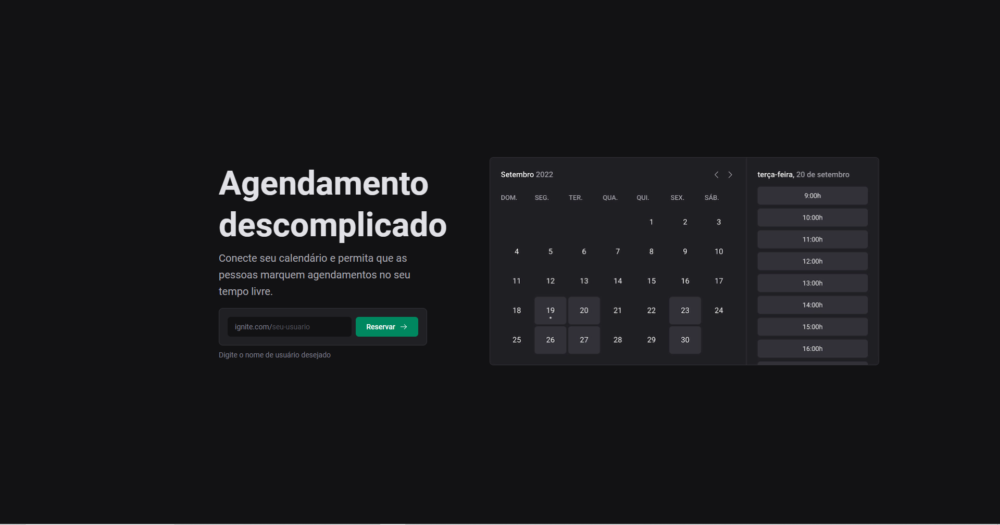
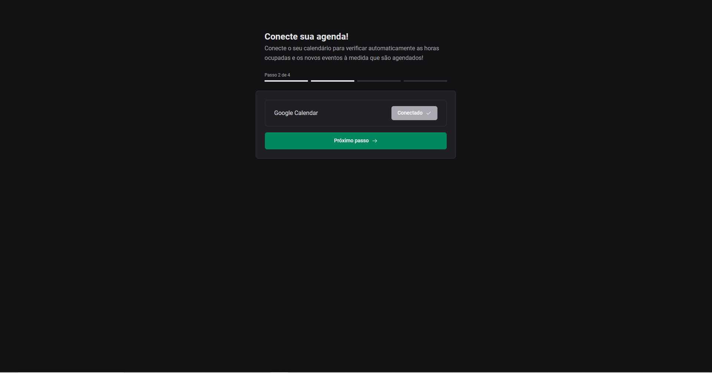
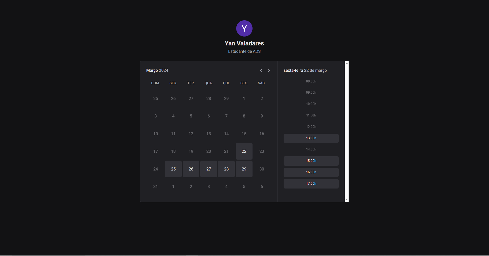
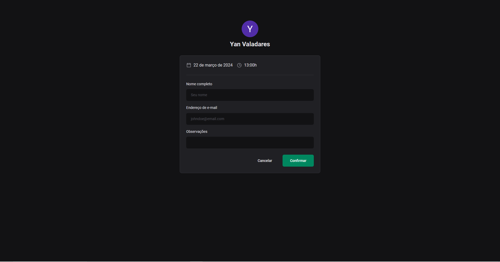
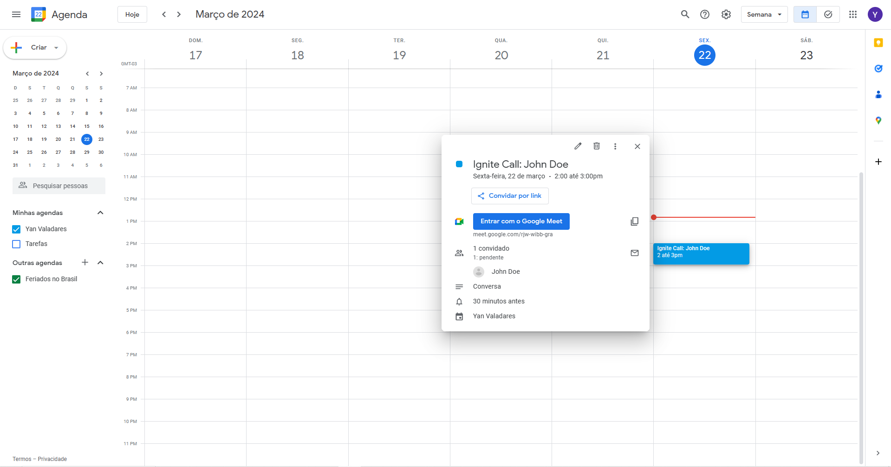

<h1 align="center"> Personal Schedule </h1>

🔨 Tools: Typescript, React.js, Next.js, Axios, DayJS, Next Auth, Google OAuth
#

# The Project

A personal schedule that you can share publicly so that other people can schedule a time with you. It is also integrated with Google Calendar, allowing you to easily view your daily appointments.

You can create your personal calendar by using this link:  
https://personal-schedule.vercel.app/

 

Once your account is created, you can share the link with other people so they can schedule a time with you. Give it a try:  
https://personal-schedule.vercel.app/schedule/yanvaladares

# Preview

## Landing Page

  

## Connect to Google Calendar

  

## Calendar Page

  

## Scheduling Page

  

## Google Calendar Schedule

  

